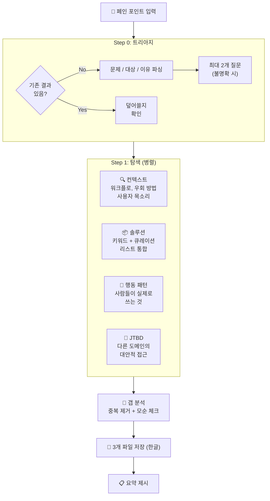

<p align="center">
  <h1 align="center">🔭 Groundwork</h1>
  <p align="center">
    만들기 전에 문제 공간을 리서치하세요.<br>
    <a href="https://docs.anthropic.com/en/docs/claude-code">Claude Code</a>용 랜드스케이프 스캔 스킬.
  </p>
</p>

<p align="center">
  <a href="LICENSE"></a>
  <a href="https://docs.anthropic.com/en/docs/claude-code"></a>
</p>

<p align="center">
  <a href="README.md">English</a>
</p>

---

**먼저 파악하고, 그다음에 만드세요.** Groundwork은 4개의 병렬 리서치 에이전트로 문제 공간을 스캔합니다 — 누가 이 문제를 겪는지, 어떻게 우회하는지, 어떤 솔루션이 있는지 — 코드 한 줄 쓰기 전에 충분한 정보를 갖추세요.

> *AI에게 충분한 맥락을 주면, AI가 더 똑똑한 답을 내놓습니다.*

## 빠른 시작

```bash
# 설치
mkdir -p ~/.claude/skills/groundwork && curl -sL https://raw.githubusercontent.com/SC-Airu/groundwork-skill/main/SKILL.md -o ~/.claude/skills/groundwork/SKILL.md

# Claude Code에서 사용
/groundwork 모바일 게임 광고 소재 AI 분석
```

## 하는 일

페인 포인트를 입력하면 ~2분 만에 3개의 구조화된 리서치 파일을 생성합니다:

```
.omc/groundwork/{slug}/
├── triage.md      # 문제 / 대상 / 이유
├── context.md     # 워크플로, 영향 대상, 우회 방법, 인접 문제, 사용자 목소리
└── solutions.md   # 솔루션 목록, 카테고리, 빈도 순위, 공백, 핵심 인사이트
```

- **4개 병렬 리서치 에이전트** — Context, Solutions, Behavior, JTBD 동시 실행 (~2-3분)
- **갭 분석** — 기존 도구가 커버하지 못하는 영역 식별
- **모순 감지** — "마케팅 주장 vs 실사용자 경험" 불일치 포착
- **중복 체크** — 기존 리서치 결과가 있으면 덮어쓰기 전 확인
- **팩트만 제시** — 빌드/킬 추천 없음. 결정은 사용자 몫.
- **영어 검색, 한글 출력** — 영어로 검색해 넓은 커버리지, 한글로 저장 ([변경 가능](#커스터마이즈))

## 작동 방식



## 리서치 에이전트

각 에이전트는 서로 다른 검색 전략과 소스를 사용합니다:

| 에이전트 | 역할 | 검색 소스 | 전략 | 제한 |
|----------|------|----------|------|------|
| **Context** | 워크플로, 우회 방법, 사용자 목소리 | Reddit, HN, 포럼, Stack Overflow | 커뮤니티 중심: 직접 인용과 실제 불만 수집 | 10회 |
| **Solutions** | 기존 도구 및 제품 | GitHub, Product Hunt, G2, Capterra, AlternativeTo, "awesome-*" 리스트, "best X alternatives" 기사 | 키워드 + 큐레이션 리스트 통합 (분리 시 70% 중복 확인) | 10회 |
| **Behavior** | 사람들이 *실제로* 쓰는 것 | Reddit, 포럼, Stack Overflow, HN | "how do you handle..." 및 "what do you use for..." 토론 검색 — 마케팅 주장과 실사용 분리 | 10회 |
| **JTBD** | 대안적 접근 방식 | 타 산업, 타 도메인 | Jobs-to-be-Done 관점: 같은 작업을 다른 방식으로 해결하는 비명시적 경쟁자 탐색 | 8회 |

모든 에이전트는 입력 언어와 무관하게 **영어**로 검색합니다 (커버리지 극대화). 4개 에이전트 완료 후 오케스트레이터가 인라인으로 갭 분석 수행: 솔루션 중복 제거, 우회 방법 교차 검증, 구조적 공백 식별, 모순점 플래그.

## 출력 예시

아래는 "모바일 게임 광고 소재 AI 분석"을 스캔한 실제 결과입니다:

<details>
<summary><strong>triage.md</strong> — 문제 정의</summary>

```markdown
# 트리아지
- 문제: AI로 모바일 게임 광고 소재(영상/이미지)를 분석하여 성과 요인을 파악하는 도구 필요
- 대상: UA/마케팅 팀, 크리에이티브 팀, 경영진/PM
- 이유: 광고 소재의 성과를 데이터 기반으로 분석해야 효율적인 UA 운영과 크리에이티브 최적화가 가능
```

</details>

<details>
<summary><strong>context.md</strong> — 워크플로 & 사용자 목소리</summary>

```markdown
# 컨텍스트: AI Ad Analyst

## 워크플로 현황
다음 UA 워크플로에서 반복적으로 발생하는 병목:
1. 캠페인 사후 분석 — Meta/AppLovin/Google/TikTok 데이터를 MMP에서 취합
2. 크리에이티브 피로도 감지 — 고지출 채널에서 소재 수명 5~10일
3. 크리에이티브 브리핑 — 과거 성과 기반 신규 컨셉 도출 (기억에 의존)
4. A/B 테스트 — 플랫폼 알고리즘이 같은 광고 세트 내 불균등 노출

## 영향 대상
| 역할 | 책임 | 기술 수준 |
|------|------|----------|
| UA 매니저 | 캠페인 예산 배분, ROAS 타겟 관리 | 중급~고급 (데이터 분석 필수) |
| 크리에이티브 전략가 | 성과 데이터 → 크리에이티브 브리프 변환 | 하이브리드 (데이터 + 크리에이티브) |
| 크리에이티브/아트 팀 | 소재 대량 제작 (2024년 기준 4,620만 소재) | 디자인/영상 전문, 데이터 분석 약함 |
| 경영진/PM | 크리에이티브 ROI 보고, 예산 승인 | 요약 데이터 소비자 |

## 현재 우회 방법
1. 수동 네이밍 컨벤션 + 스프레드시트 — 팀당 주 ~20시간 소요
2. 플랫폼 간 수동 전환 — Meta/AppLovin/TikTok/MMP 대시보드 번갈아 확인
3. 경쟁사 스파이 도구 — 장기 운영 소재 = 수익성 있다고 추론
4. 물량 전략 — 월 20~40개 소재 제작, 알고리즘에 위너 발견 위임

## 사용자 목소리
> "Performance data is abundant, but actionable creative insight is scarce."
> — Segwise, 2026

> "Managing naming conventions was heinous."
> — Foxwell Digital
```

</details>

<details open>
<summary><strong>solutions.md</strong> — 솔루션 현황 (주요 섹션)</summary>

```markdown
# 솔루션 현황: AI Ad Analyst

## 솔루션 목록
| 이름 | 접근 방식 | 강점 | 약점 |
|------|----------|------|------|
| Segwise | 멀티모달 AI 태깅 → IPM/CTR/ROAS 연결 | 모바일 게임 특화, 플레이어블 광고 지원 | 신생 업체 |
| AppsFlyer Creative Opt. | AI 씬 분해 + MMP 어트리뷰션 연동 | 어트리뷰션 직접 연결 | AppsFlyer MMP 종속 |
| VidMob | AI + 휴먼 전문가 스코어링, 크로스 채널 | 업계 인컴번트, 300+ 브랜드 | 엔터프라이즈 전용, 고비용 |
| Replai | 컴퓨터 비전, 프레임별 영상 태깅 | $5B+ 광고비 처리 | 영상 전용, 플레이어블 미지원 |
| SensorTower | 경쟁사 크리에이티브 갤러리, 14+ 네트워크 | 시장 리더 | $25K+/년, 자사 소재 AI 없음 |
| Motion | 비주얼 중심 크리에이티브 분석 | UI 직관적, $299~599/월 | 게임 특화 아님 |
| ... | (총 22개 솔루션, 6개 카테고리) | | |

## 카테고리 분류
1. AI 크리에이티브 분석 (자사 소재) — Segwise, AppsFlyer, VidMob, Replai ...
2. 경쟁사 인텔리전스 (Ad Spy) — SensorTower, MobileAction, AppMagic ...
3. AI 크리에이티브 생성 — Pencil, AdCreative.ai, Predis.ai
4. 자동 다변량 테스트 — Marpipe, Smartly.io
5. 프리론칭 소비자 테스트 — System1, Kantar, Behavio
6. 뉴로사이언스/어텐션 — Realeyes, Dragonfly AI

## 핵심 공백
전체 파이프라인을 해결하는 도구가 없음:
| 공백 | 설명 |
|------|------|
| 소재 요소→리텐션/LTV | 크리에이티브 속성을 D1/D7/D30 리텐션과 연결하는 도구 부재 |
| 플레이어블 광고 분석 | 인터랙티브 광고의 AI 분석은 Segwise만 시도 |
| 통합 워크플로 | 경쟁사 인텔리전스 + 자사 분석 + 브리핑에 3~5개 도구 필요 |
| 게임 특화 + 합리적 가격 | 게임 특화 도구는 엔터프라이즈 가격, 저가 도구는 e-commerce 중심 |

## 모순점
| 모순 | 마케팅 | 실제 |
|------|--------|------|
| AI 크리에이티브 분석 도구 보급 | "다수 존재" | 대부분 팀은 여전히 스프레드시트 + 네이밍 컨벤션 |
| VidMob 접근성 | 최다 인용 인컴번트 | 엔터프라이즈 전용, 중소 스튜디오 접근 불가 |
| 물량 전략 효율성 | "더 많이 만들면 위너 발견" | 2% 소재가 68% 광고비 소비 — 98% 구조적 낭비 |

## 핵심 인사이트
시장은 "데이터는 풍부하지만 인사이트는 부족한" 구조적 역설 상태.
대부분의 UA 팀은 여전히 수동 태깅 + 스프레드시트에 의존. AI 크리에이티브
인텔리전스 도구(Segwise, Replai, Reforged Labs)가 부상하고 있으나 초기 채택 단계.
가장 큰 미해결 문제: 소재 요소→다운스트림 지표(리텐션/LTV) 연결,
플레이어블 광고 분석, 분석→브리핑→제작 통합 워크플로.
```

</details>

### 터미널 요약

리서치가 완료되면 간략한 요약이 표시됩니다:

```
## Groundwork 완료: ai-ad-analyst

### 컨텍스트
- 모바일 게임 UA 팀은 광고 소재의 성과 데이터는 풍부하지만, "왜 잘됐는지" 요소 수준
  인사이트가 부족해 수동 태깅+스프레드시트에 의존하는 구조적 병목 존재
- 주요 워크어라운드: 네이밍 컨벤션 + 피벗 테이블 (팀당 주 ~20시간), 물량 전략(월 20~40개 소재)

### 솔루션 현황
- 22개 솔루션, 6개 카테고리 (AI 자사 분석 / 경쟁사 인텔리전스 / AI 생성 / 다변량 테스트
  / 프리론칭 테스트 / 뉴로사이언스)
- 핵심 인사이트: AI 크리에이티브 인텔리전스 도구(Segwise, Replai, Reforged Labs)가 부상
  중이나 아직 초기 채택 단계. 대부분의 팀은 여전히 스프레드시트 기반
- 핵심 공백: ①소재 요소→리텐션/LTV 연결 ②플레이어블 광고 AI 분석 ③경쟁사 인텔리전스
  +자사 분석+브리핑을 잇는 통합 워크플로 ④중소 게임 스튜디오를 위한 게임 특화+합리적 가격 조합

### 파일
- .omc/groundwork/ai-ad-analyst/triage.md
- .omc/groundwork/ai-ad-analyst/context.md
- .omc/groundwork/ai-ad-analyst/solutions.md
```

## 사용법

```bash
# 한글 입력
/groundwork 모바일 게임 광고 소재 AI 분석

# 영어 입력
/groundwork AI ad creative analysis for mobile games

# 상세 입력 (트리아지 질문 스킵)
/groundwork Music Prompt Builder - 클릭 몇 번으로 Suno AI용 BGM 프롬프트 생성.
  기획자가 게임 배경, 음악 스타일, 분위기, 템포, 악기를 선택하면
  전문 음악 용어로 번역된 프롬프트를 자동 생성.
```

## 커스터마이즈

<details>
<summary><strong>출력 언어 변경</strong></summary>

`SKILL.md`의 `<Execution_Policy>` 섹션 수정:

```
- All saved files: written in Korean.
```

원하는 언어로 변경. 에이전트 검색은 항상 영어로 수행됩니다.

</details>

<details>
<summary><strong>검색 깊이 조절</strong></summary>

각 에이전트에 `Limit to N web searches max` 지시가 있음. 기본값: 대부분 10회, JTBD 8회.

- 깊은 리서치 → 증가
- 속도 우선 → 감소

</details>

<details>
<summary><strong>다른 스킬과 연계</strong></summary>

Groundwork 결과물은 후속 스킬에서 참조하도록 설계되었습니다:

| 스킬 | 연계 방식 |
|------|----------|
| `/plan` | `triage.md` 읽어서 문제 컨텍스트 파악 |
| `CLAUDE.md` | groundwork 파일 경로 기록해서 팀 컨텍스트 공유 |

</details>

## 요구사항

- [Claude Code](https://docs.anthropic.com/en/docs/claude-code) CLI
- [oh-my-claudecode](https://github.com/nicholasgriffintn/oh-my-claudecode) (`document-specialist` 에이전트 라우팅용)

## 설계 결정

| 결정 | 이유 |
|------|------|
| **에이전트 4개 (6개 아님)** | Keyword + Curated 통합 (테스트 시 70% 중복). Behavior 분리 유지 — *마케팅* vs *실사용* 구분 필요. |
| **Gap Check 별도 에이전트 없음** | 오케스트레이터가 인라인 수행. 테스트 결과 품질 손실 없음. |
| **영어 검색** | 로컬 언어보다 넓은 커버리지. 출력 언어는 별도 설정. |
| **Depth 모드 없음** | 단일 모드. 4개 에이전트가 속도와 커버리지의 최적점. |

## 기여

이슈와 PR 환영합니다. 단일 파일 스킬(`SKILL.md`)이므로 변경은 집중적으로.

## 라이선스

[MIT](LICENSE)
