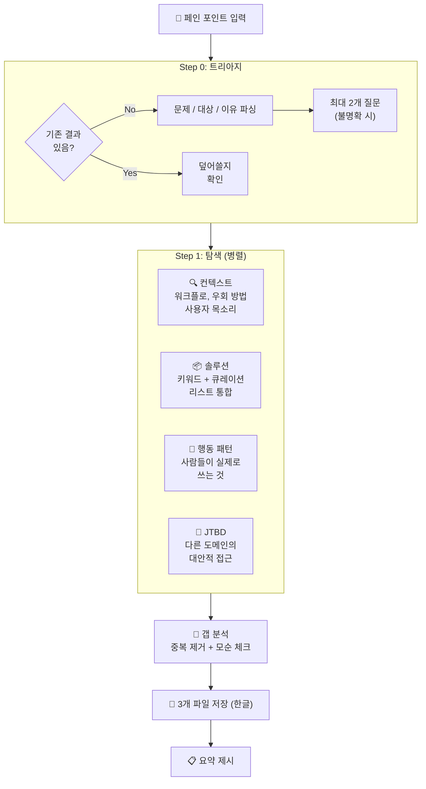

<p align="center">
  <h1 align="center">Groundwork</h1>
  <p align="center">
    만들기 전에 문제 공간을 리서치하세요.<br>
    <a href="https://docs.anthropic.com/en/docs/claude-code">Claude Code</a>용 랜드스케이프 스캔 스킬.
  </p>
</p>

<p align="center">
  <a href="LICENSE"></a>
  <a href="SKILL.md"></a>
  <a href="https://docs.anthropic.com/en/docs/claude-code"></a>
</p>

<p align="center">
  <a href="README.md">English</a>
</p>

---

**이미 있는 걸 또 만들고 있진 않나요?** Groundwork은 4개의 병렬 리서치 에이전트로 문제 공간을 스캔합니다 — 누가 이 문제를 겪는지, 어떻게 우회하는지, 어떤 솔루션이 있는지 — 코드 한 줄 쓰기 전에 충분한 정보를 갖추세요.

## 빠른 시작

```bash
# 설치
mkdir -p ~/.claude/skills/groundwork && curl -sL https://raw.githubusercontent.com/SC-Airu/groundwork-skill/main/SKILL.md -o ~/.claude/skills/groundwork/SKILL.md

# Claude Code에서 사용
/groundwork 게임 사운드 자동 배치 - AI가 영상 분석해 효과음 자동 삽입
```

## 하는 일

페인 포인트를 입력하면 ~2분 만에 3개의 구조화된 리서치 파일을 생성합니다:

```
.omc/groundwork/{slug}/
├── triage.md      # 문제 / 대상 / 이유
├── context.md     # 워크플로, 영향 대상, 우회 방법, 인접 문제, 사용자 목소리
└── solutions.md   # 솔루션 목록, 카테고리, 빈도 순위, 공백, 핵심 인사이트
```

## 작동 방식



## 출력 예시

아래는 "게임 광고 사운드 자동 배치"를 스캔한 실제 결과입니다:

<details>
<summary><strong>triage.md</strong> — 문제 정의</summary>

```markdown
# 트리아지
- 문제: 게임 광고 영상에 사운드를 자동 배치하는 도구.
       AI가 영상을 분석해 구간별로 미리 지정된 효과음을 자동 삽입. After Effects 기준.
- 대상: 게임 광고 영상 제작자 (모션 디자이너, 크리에이티브 프로듀서)
- 이유: 타이틀별 사운드가 거의 고정인데 매번 수동 타이밍 조절하는 리소스가 큼. 반복 작업 제거 목적.
```

</details>

<details>
<summary><strong>context.md</strong> — 워크플로 & 사용자 목소리</summary>

```markdown
# 컨텍스트: 사운드 자동 배치

## 워크플로 현황
게임 스튜디오의 UA 광고 영상 제작 파이프라인에서 발생:
1. 크리에이티브 팀이 광고 브리프 수령 (15~30초 영상)
2. 모션 디자이너가 After Effects에서 게임플레이 푸티지/애니메이션 조립
3. 타이틀별 고정 SFX 라이브러리에서 효과음을 수동으로 타임라인에 배치
4. A/B 테스트용 변형 반복 — 매번 SFX 재배치 필요

## 영향 대상
| 역할 | 책임 | 기술 수준 |
|------|------|----------|
| 모션 디자이너 | AE에서 광고 영상 조립 + SFX 배치 직접 수행 | AE 중~고급, 오디오는 비전문 |
| 영상 에디터 | 편집 + 기본 사운드 디자인 겸임 | 제너럴리스트, 고볼륨 처리 |

## 현재 우회 방법
1. 수동 타임라인 스크러빙 — 넘패드 * 키로 마커 찍기 → SFX 수동 배치
2. MonkeySauce — 마커→SFX 할당 자동화 (단, 마커 자체는 수동)
3. 템플릿 기반 프리리깅 — SFX 미리 포지션된 AE 프로젝트 템플릿

## 사용자 목소리
> "Sound is often left until the end of the process when sound is actually
>  responsible for half OR MORE of the emotional impact of work."
> — School of Motion
```

</details>

<details open>
<summary><strong>solutions.md</strong> — 솔루션 현황 (주요 섹션)</summary>

```markdown
# 솔루션 현황: 사운드 자동 배치

## 솔루션 목록
| 이름 | 접근 방식 | 강점 | 약점 |
|------|----------|------|------|
| MonkeySauce | AE 스크립트: 마커 기반 SFX 트리거 | AE 네이티브, 커스텀 SFX 가능 | 마커는 수동, 영상 분석 없음 |
| ElevenLabs V2S | AI: GPT-4o 비전 → SFX 생성 | API 사용 가능 | 커스텀 라이브러리 미지원 |
| MMAudio | 오픈소스: 비디오→오디오 합성 | 무료, 로컬 실행 | 개별 SFX 아닌 앰비언트 생성 |
| CapCut Auto | 소비자 에디터: AI SFX 자동 배치 | 무료, 빠름 | 소비자급, 커스텀 SFX 불가 |
| ... | (총 24개 솔루션) | | |

## 카테고리 분류
1. AE 네이티브 도구 (수동/반자동) — MonkeySauce, Boombox, SoundBox ...
2. AI SFX 생성 (새 사운드 합성) — ElevenLabs, MMAudio, FoleyCrafter ...
3. 소비자 자동 SFX 에디터 — CapCut, Submagic, FlexClip ...
4. 게임 엔진 직접 캡처 — Unreal Take Recorder, UE4Capture

## 핵심 공백
3-레이어 문제를 해결하는 도구가 없음:
| 레이어 | 필요 기능 | 현존 도구 |
|--------|----------|----------|
| 1. 이벤트 감지 | AI가 게임 이벤트 감지 | ElevenLabs (부분적) |
| 2. SFX 매핑 | 이벤트→커스텀 SFX 선택 | MonkeySauce (수동) |
| 3. AE 배치 | 정확한 프레임에 배치 | MonkeySauce, ExtendScript |

## 모순점
| 모순 | 마케팅 | 실제 |
|------|--------|------|
| AI SFX 도구 실용성 | "다수 존재" | 게임 광고 프로는 아무도 안 씀 |
| MonkeySauce 충분성 | "24개 레시피로 자동화" | 감지 아닌 할당만 해결 |

## 핵심 인사이트
도구가 없어서가 아니라 도구들이 각각 다른 레이어만 해결하기 때문에 발생.
AI 비전 기술은 이벤트를 감지할 수 있고, AE 스크립팅은 배치할 수 있다.
그러나 이 둘을 연결하면서 커스텀 SFX 라이브러리를 매핑하는 통합 레이어가 없다.
```

</details>

### 터미널 요약

리서치가 완료되면 간략한 요약이 표시됩니다:

```
## Groundwork 완료: sound-auto-placement

### 컨텍스트
- 게임 광고 모션 디자이너가 타이틀별 고정 SFX를 매 영상마다 수동 배치
- 주요 워크어라운드: MonkeySauce (마커→SFX 자동 할당, 단 마커는 수동)

### 솔루션 현황
- 24개 솔루션, 7개 카테고리
- 핵심 인사이트: 3-레이어 문제(감지/매핑/배치)를 해결하는 도구 없음
- 핵심 공백: AI SFX 도구 다수 존재하나 커스텀 라이브러리 미지원이 치명적

### 파일
- .omc/groundwork/sound-auto-placement/triage.md
- .omc/groundwork/sound-auto-placement/context.md
- .omc/groundwork/sound-auto-placement/solutions.md
```

## 주요 기능

- **4개 병렬 리서치 에이전트** — Context, Solutions, Behavior, JTBD 동시 실행 (~2-3분)
- **갭 분석** — 기존 도구가 커버하지 못하는 영역 식별
- **모순 감지** — "마케팅 주장 vs 실사용자 경험" 불일치 포착
- **중복 체크** — 기존 리서치 결과가 있으면 덮어쓰기 전 확인
- **팩트만 제시** — 빌드/킬 추천 없음. 결정은 사용자 몫.
- **영어 검색, 한글 출력** — 영어로 검색해 넓은 커버리지, 한글로 저장 (변경 가능)

## 요구사항

- [Claude Code](https://docs.anthropic.com/en/docs/claude-code) CLI
- [oh-my-claudecode](https://github.com/nicholasgriffintn/oh-my-claudecode) (`document-specialist` 에이전트 라우팅용)

## 사용법

```bash
# 한글 입력
/groundwork 게임 사운드 자동 배치 - AI가 영상 분석해 효과음 자동 삽입

# 영어 입력
/groundwork auto SFX placement for game ad videos in After Effects

# 상세 입력 (트리아지 질문 스킵)
/groundwork Music Prompt Builder - 클릭 몇 번으로 Suno AI용 BGM 프롬프트 생성.
  기획자가 게임 배경, 음악 스타일, 분위기, 템포, 악기를 선택하면
  전문 음악 용어로 번역된 프롬프트를 자동 생성.
```

## 커스터마이즈

<details>
<summary><strong>출력 언어 변경</strong></summary>

`SKILL.md`의 `<Execution_Policy>` 섹션 수정:

```
- All saved files: written in Korean.
```

원하는 언어로 변경. 에이전트 검색은 항상 영어로 수행됩니다.

</details>

<details>
<summary><strong>검색 깊이 조절</strong></summary>

각 에이전트에 `Limit to N web searches max` 지시가 있음. 기본값: 대부분 10회, JTBD 8회.

- 깊은 리서치 → 증가
- 속도 우선 → 감소

</details>

<details>
<summary><strong>다른 스킬과 연계</strong></summary>

Groundwork 결과물은 후속 스킬에서 참조하도록 설계되었습니다:

| 스킬 | 연계 방식 |
|------|----------|
| `/plan` | `triage.md` 읽어서 문제 컨텍스트 파악 |
| `/discovery` | groundwork 결과 있으면 Step 0-1 스킵 |
| `CLAUDE.md` | groundwork 파일 경로 기록해서 팀 컨텍스트 공유 |

</details>

## 설계 결정

| 결정 | 이유 |
|------|------|
| **에이전트 4개 (6개 아님)** | Keyword + Curated 통합 (테스트 시 70% 중복). Behavior 분리 유지 — *마케팅* vs *실사용* 구분 필요. |
| **Gap Check 별도 에이전트 없음** | 오케스트레이터가 인라인 수행. 테스트 결과 품질 손실 없음. |
| **영어 검색** | 로컬 언어보다 넓은 커버리지. 출력 언어는 별도 설정. |
| **Depth 모드 없음** | 단일 모드. 4개 에이전트가 속도와 커버리지의 최적점. |

## 진화 과정

| 버전 | 에이전트 | 시간 | 변경 |
|------|---------|------|------|
| v1 | 6 | ~5분 | Discovery Step 1 포크. Keyword+Curated 70% 중복. |
| v2 | 2-4 | 가변 | Depth 모드 추가. 오버엔지니어링. |
| v3 | 3 | ~2분 | Depth 제거. Behavior를 Solutions에 통합 — 고유 발견 손실. |
| **v4** | **4** | **~2.3분** | Behavior 재분리. Keyword+Curated 통합. Gap Check 인라인. |

## 기여

이슈와 PR 환영합니다. 단일 파일 스킬(`SKILL.md`)이므로 변경은 집중적으로.

## 라이선스

[MIT](LICENSE)
