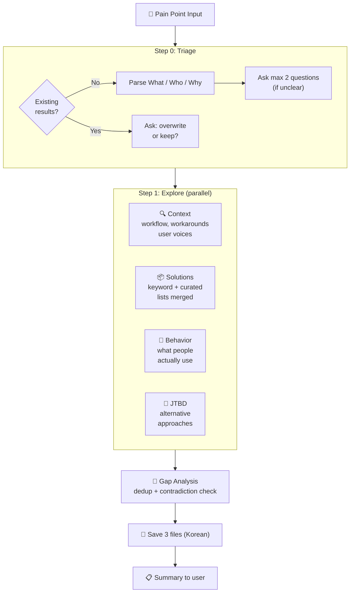

<p align="center">
  <h1 align="center">Groundwork</h1>
  <p align="center">
    Research the problem space before you build.<br>
    A landscape scan skill for <a href="https://docs.anthropic.com/en/docs/claude-code">Claude Code</a>.
  </p>
</p>

<p align="center">
  <a href="LICENSE"></a>
  <a href="SKILL.md"></a>
  <a href="https://docs.anthropic.com/en/docs/claude-code"></a>
</p>

<p align="center">
  <a href="README.ko.md">한국어</a>
</p>

---

**Tired of building something that already exists?** Groundwork runs 4 parallel research agents to scan the landscape — who has this problem, how they work around it, and what solutions exist — so you can make informed decisions before writing a single line of code.

## Quick Start

```bash
# Install
mkdir -p ~/.claude/skills/groundwork && curl -sL https://raw.githubusercontent.com/SC-Airu/groundwork-skill/main/SKILL.md -o ~/.claude/skills/groundwork/SKILL.md

# Use in Claude Code
/groundwork auto SFX placement for game ad videos in After Effects
```

## What It Does

Give it a pain point. Get back 3 structured research files in ~2 minutes:

```
.omc/groundwork/{slug}/
├── triage.md      # Problem / Who / Why
├── context.md     # Workflow, affected roles, workarounds, adjacent problems, user voices
└── solutions.md   # Solution list, categories, frequency ranking, gaps, key insight
```

## How It Works



## Example Output

Below is a real example from scanning "auto SFX placement for game ad videos":

<details>
<summary><strong>triage.md</strong> — Problem definition</summary>

```markdown
# 트리아지
- 문제: 게임 광고 영상에 사운드를 자동 배치하는 도구.
       AI가 영상을 분석해 구간별로 미리 지정된 효과음을 자동 삽입. After Effects 기준.
- 대상: 게임 광고 영상 제작자 (모션 디자이너, 크리에이티브 프로듀서)
- 이유: 타이틀별 사운드가 거의 고정인데 매번 수동 타이밍 조절하는 리소스가 큼. 반복 작업 제거 목적.
```

</details>

<details>
<summary><strong>context.md</strong> — Workflow & user voices</summary>

```markdown
# 컨텍스트: 사운드 자동 배치

## 워크플로 현황
게임 스튜디오의 UA 광고 영상 제작 파이프라인에서 발생:
1. 크리에이티브 팀이 광고 브리프 수령 (15~30초 영상)
2. 모션 디자이너가 After Effects에서 게임플레이 푸티지/애니메이션 조립
3. 타이틀별 고정 SFX 라이브러리에서 효과음을 수동으로 타임라인에 배치
4. A/B 테스트용 변형 반복 — 매번 SFX 재배치 필요

## 영향 대상
| 역할 | 책임 | 기술 수준 |
|------|------|----------|
| 모션 디자이너 | AE에서 광고 영상 조립 + SFX 배치 직접 수행 | AE 중~고급, 오디오는 비전문 |
| 영상 에디터 | 편집 + 기본 사운드 디자인 겸임 | 제너럴리스트, 고볼륨 처리 |

## 현재 우회 방법
1. 수동 타임라인 스크러빙 — 넘패드 * 키로 마커 찍기 → SFX 수동 배치
2. MonkeySauce — 마커→SFX 할당 자동화 (단, 마커 자체는 수동)
3. 템플릿 기반 프리리깅 — SFX 미리 포지션된 AE 프로젝트 템플릿

## 사용자 목소리
> "Sound is often left until the end of the process when sound is actually
>  responsible for half OR MORE of the emotional impact of work."
> — School of Motion
```

</details>

<details open>
<summary><strong>solutions.md</strong> — Solution landscape (key sections)</summary>

```markdown
# 솔루션 현황: 사운드 자동 배치

## 솔루션 목록
| 이름 | 접근 방식 | 강점 | 약점 |
|------|----------|------|------|
| MonkeySauce | AE 스크립트: 마커 기반 SFX 트리거 | AE 네이티브, 커스텀 SFX 가능 | 마커는 수동, 영상 분석 없음 |
| ElevenLabs V2S | AI: GPT-4o 비전 → SFX 생성 | API 사용 가능 | 커스텀 라이브러리 미지원 |
| MMAudio | 오픈소스: 비디오→오디오 합성 | 무료, 로컬 실행 | 개별 SFX 아닌 앰비언트 생성 |
| CapCut Auto | 소비자 에디터: AI SFX 자동 배치 | 무료, 빠름 | 소비자급, 커스텀 SFX 불가 |
| ... | (총 24개 솔루션) | | |

## 카테고리 분류
1. AE 네이티브 도구 (수동/반자동) — MonkeySauce, Boombox, SoundBox ...
2. AI SFX 생성 (새 사운드 합성) — ElevenLabs, MMAudio, FoleyCrafter ...
3. 소비자 자동 SFX 에디터 — CapCut, Submagic, FlexClip ...
4. 게임 엔진 직접 캡처 — Unreal Take Recorder, UE4Capture

## 핵심 공백
3-레이어 문제를 해결하는 도구가 없음:
| 레이어 | 필요 기능 | 현존 도구 |
|--------|----------|----------|
| 1. 이벤트 감지 | AI가 게임 이벤트 감지 | ElevenLabs (부분적) |
| 2. SFX 매핑 | 이벤트→커스텀 SFX 선택 | MonkeySauce (수동) |
| 3. AE 배치 | 정확한 프레임에 배치 | MonkeySauce, ExtendScript |

## 모순점
| 모순 | 마케팅 | 실제 |
|------|--------|------|
| AI SFX 도구 실용성 | "다수 존재" | 게임 광고 프로는 아무도 안 씀 |
| MonkeySauce 충분성 | "24개 레시피로 자동화" | 감지 아닌 할당만 해결 |

## 핵심 인사이트
도구가 없어서가 아니라 도구들이 각각 다른 레이어만 해결하기 때문에 발생.
AI 비전 기술은 이벤트를 감지할 수 있고, AE 스크립팅은 배치할 수 있다.
그러나 이 둘을 연결하면서 커스텀 SFX 라이브러리를 매핑하는 통합 레이어가 없다.
```

</details>

### Terminal Summary

After research completes, you get a brief summary:

```
## Groundwork 완료: sound-auto-placement

### 컨텍스트
- 게임 광고 모션 디자이너가 타이틀별 고정 SFX를 매 영상마다 수동 배치
- 주요 워크어라운드: MonkeySauce (마커→SFX 자동 할당, 단 마커는 수동)

### 솔루션 현황
- 24개 솔루션, 7개 카테고리
- 핵심 인사이트: 3-레이어 문제(감지/매핑/배치)를 해결하는 도구 없음
- 핵심 공백: AI SFX 도구 다수 존재하나 커스텀 라이브러리 미지원이 치명적

### 파일
- .omc/groundwork/sound-auto-placement/triage.md
- .omc/groundwork/sound-auto-placement/context.md
- .omc/groundwork/sound-auto-placement/solutions.md
```

## Features

- **4 parallel research agents** — Context, Solutions, Behavior, JTBD run simultaneously (~2-3 min)
- **Gap analysis** — Finds what no existing tool covers
- **Contradiction detection** — Catches "marketed as X" vs "users say Y" discrepancies
- **Duplicate check** — Won't overwrite existing research without asking
- **Facts only** — No build/kill recommendations. You decide.
- **English search, localized output** — Searches in English for broad coverage, saves in Korean (configurable)

## Requirements

- [Claude Code](https://docs.anthropic.com/en/docs/claude-code) CLI
- [oh-my-claudecode](https://github.com/nicholasgriffintn/oh-my-claudecode) (for `document-specialist` agent routing)

## Usage

```bash
# Korean input
/groundwork 게임 사운드 자동 배치 - AI가 영상 분석해 효과음 자동 삽입

# English input
/groundwork auto SFX placement for game ad videos in After Effects

# Detailed input (skips triage questions)
/groundwork Music Prompt Builder - a tool that generates Suno AI BGM prompts
  through simple clicks. Planners select game background, style, mood, tempo,
  instruments and get translated professional music terminology prompts.
```

## Customization

<details>
<summary><strong>Change output language</strong></summary>

Edit the `<Execution_Policy>` section in `SKILL.md`:

```
- All saved files: written in Korean.
```

Change to your preferred language. Research agents always search in English.

</details>

<details>
<summary><strong>Adjust search depth</strong></summary>

Each agent has a `Limit to N web searches max` instruction. Defaults: 10 for most agents, 8 for JTBD.

- Increase for deeper research
- Decrease for speed

</details>

<details>
<summary><strong>Use with downstream skills</strong></summary>

Groundwork output is designed to feed into other skills:

| Skill | How |
|-------|-----|
| `/plan` | Reads `triage.md` for problem context |
| `/discovery` | Skips Steps 0-1 if groundwork exists |
| `CLAUDE.md` | Reference groundwork files for team context |

</details>

## Design Decisions

| Decision | Why |
|----------|-----|
| **4 agents, not 6** | Keyword + Curated merged (70% overlap in testing). Behavior kept separate — finds what people *use* vs what's *marketed*. |
| **No Gap Check agent** | Orchestrator handles dedup + contradiction inline. No quality loss in testing. |
| **English search** | Broader coverage than localized search. Output language is separate. |
| **No depth modes** | Single mode. 4 agents is the sweet spot between speed and coverage. |

## Evolution

| Version | Agents | Time | Change |
|---------|--------|------|--------|
| v1 | 6 | ~5min | Discovery Step 1 fork. Keyword+Curated had 70% overlap. |
| v2 | 2-4 | varies | Added depth modes. Over-engineered. |
| v3 | 3 | ~2min | Removed depth. Merged Behavior into Solutions — lost findings. |
| **v4** | **4** | **~2.3min** | Behavior separated. Keyword+Curated merged. Gap Check inline. |

## Contributing

Issues and PRs welcome. This is a single-file skill (`SKILL.md`) — keep changes focused.

## License

[MIT](LICENSE)
