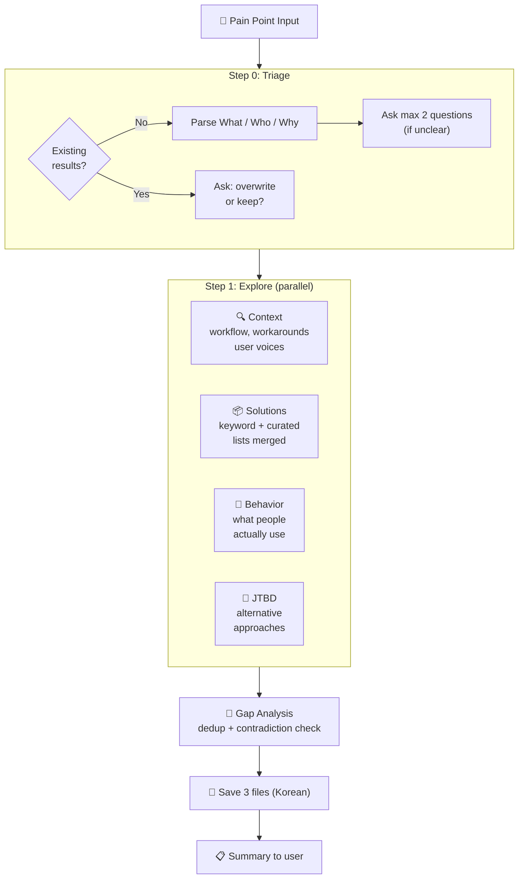

<p align="center">
  <h1 align="center">🔭 Groundwork</h1>
  <p align="center">
    Research the problem space before you build.<br>
    A landscape scan skill for <a href="https://docs.anthropic.com/en/docs/claude-code">Claude Code</a>.
  </p>
</p>

<p align="center">
  <a href="LICENSE"></a>
  <a href="https://docs.anthropic.com/en/docs/claude-code"></a>
</p>

<p align="center">
  <a href="README.ko.md">한국어</a>
</p>

---

**Don't build blind.** Groundwork runs 4 parallel research agents to scan the landscape — who has this problem, how they work around it, and what solutions exist — so you can make informed decisions before writing a single line of code.

> *Give your AI real-world context and it gives you smarter answers.*

## Quick Start

```bash
# Install
mkdir -p ~/.claude/skills/groundwork && curl -sL https://raw.githubusercontent.com/SC-Airu/groundwork-skill/main/SKILL.md -o ~/.claude/skills/groundwork/SKILL.md

# Use in Claude Code
/groundwork AI ad creative analysis for mobile games
```

## What It Does

Give it a pain point. Get back 3 structured research files in ~2 minutes:

```
.omc/groundwork/{slug}/
├── triage.md      # Problem / Who / Why
├── context.md     # Workflow, affected roles, workarounds, adjacent problems, user voices
└── solutions.md   # Solution list, categories, frequency ranking, gaps, key insight
```

- **4 parallel research agents** — Context, Solutions, Behavior, JTBD run simultaneously (~2-3 min)
- **Gap analysis** — Finds what no existing tool covers
- **Contradiction detection** — Catches "marketed as X" vs "users say Y" discrepancies
- **Duplicate check** — Won't overwrite existing research without asking
- **Facts only** — No build/kill recommendations. You decide.
- **English search, localized output** — Searches in English for broad coverage, saves in Korean ([configurable](#customization))

## How It Works



## Research Agents

Each agent has a distinct search strategy and source set:

| Agent | Role | Sources | Strategy | Limit |
|-------|------|---------|----------|-------|
| **Context** | Workflow, workarounds, user voices | Reddit, HN, forums, Stack Overflow | Community-focused: finds direct quotes and real frustrations | 10 searches |
| **Solutions** | Existing tools and products | GitHub, Product Hunt, G2, Capterra, AlternativeTo, "awesome-*" lists, "best X alternatives" articles | Keyword + curated lists merged (70% overlap in testing when separate) | 10 searches |
| **Behavior** | What people *actually* use | Reddit, forums, Stack Overflow, HN | Searches "how do you handle..." and "what do you use for..." discussions — separates marketed claims from real usage | 10 searches |
| **JTBD** | Alternative approaches | Cross-industry, cross-domain | Jobs-to-be-Done lens: finds non-obvious competitors solving the same job differently | 8 searches |

All agents search in **English** regardless of input language, for maximum coverage. After all 4 complete, the orchestrator runs gap analysis inline: deduplicates solutions, cross-references workarounds, identifies structural gaps, and flags contradictions.

## Example Output

Below is a real example from scanning "AI ad creative analysis for mobile games".
> **Note:** Default output is in Korean. Shown here in English for readability. Output language is [configurable](#customization).

<details>
<summary><strong>triage.md</strong> — Problem definition</summary>

```markdown
# Triage
- Problem: AI-powered analysis of mobile game ad creatives (video/image)
          to identify what drives performance
- Who: UA/marketing teams, creative teams, executives/PMs
- Why: Data-driven ad creative analysis is essential for efficient UA operations
       and creative optimization
```

</details>

<details>
<summary><strong>context.md</strong> — Workflow & user voices</summary>

```markdown
# Context: AI Ad Analyst

## Current Workflow
Bottleneck recurs across these UA workflows:
1. Post-campaign review — aggregate data from Meta/AppLovin/Google/TikTok via MMP
2. Creative fatigue detection — creative lifespan 5-10 days on high-spend channels
3. Creative briefing — derive new concepts from past performance (relies on memory)
4. A/B testing — platform algorithms cause uneven exposure within ad sets

## Who Is Affected
| Role | Responsibility | Skill Level |
|------|---------------|-------------|
| UA Manager | Campaign budgets, ROAS targets | Mid-advanced (data analysis required) |
| Creative Strategist | Translate performance data → creative briefs | Hybrid (data + creative) |
| Creative/Art Team | Mass asset production (46.2M assets in 2024) | Design/video expert, weak on data |
| Executives/PM | Creative ROI reporting, budget approval | Summary data consumer |

## Current Workarounds
1. Manual naming conventions + spreadsheets — ~20 hrs/week per team
2. Cross-platform manual switching between Meta/AppLovin/TikTok/MMP dashboards
3. Competitor spy tools — long-running creatives assumed profitable
4. Volume strategy — produce 20-40 new creatives/month, let algorithm find winners

## User Voices
> "Performance data is abundant, but actionable creative insight is scarce."
> — Segwise, 2026

> "Managing naming conventions was heinous."
> — Foxwell Digital
```

</details>

<details open>
<summary><strong>solutions.md</strong> — Solution landscape (key sections)</summary>

```markdown
# Solution Landscape: AI Ad Analyst

## Solution List
| Name | Approach | Strengths | Weaknesses |
|------|----------|-----------|------------|
| Segwise | Multimodal AI tagging → IPM/CTR/ROAS | Mobile game native, playable ads | Newer entrant |
| AppsFlyer Creative Opt. | AI scene decomposition + MMP attribution | Direct attribution link | Requires AppsFlyer as MMP |
| VidMob | AI + human expert scoring, cross-channel | Industry incumbent, 300+ brands | Enterprise-only, expensive |
| Replai | Computer vision, frame-by-frame video tagging | $5B+ ad spend processed | Video-only, no playable ads |
| SensorTower | Competitor creative gallery, 14+ networks | Market leader | $25K+/yr, no own-creative AI |
| Motion | Visual-first creative analytics | Intuitive UI, $299-599/mo | Not game-specific |
| ... | (22 solutions total, 6 categories) | | |

## Categories
1. AI Creative Analysis (own creatives) — Segwise, AppsFlyer, VidMob, Replai ...
2. Competitor Intelligence (ad spy) — SensorTower, MobileAction, AppMagic ...
3. AI Creative Generation — Pencil, AdCreative.ai, Predis.ai
4. Automated Multivariate Testing — Marpipe, Smartly.io
5. Pre-Launch Consumer Testing — System1, Kantar, Behavio
6. Neuroscience/Attention — Realeyes, Dragonfly AI

## Key Gap
No tool solves the full pipeline:
| Gap | Description |
|-----|-------------|
| Element → Retention/LTV | No tool connects creative attributes to D1/D7/D30 retention |
| Playable Ad Analysis | Only Segwise attempts AI analysis of interactive ads |
| Integrated Workflow | Competitor intel + own analysis + briefing requires 3-5 separate tools |
| Game-specific + Affordable | Game-native tools are enterprise-priced; affordable tools are e-commerce focused |

## Contradictions
| Contradiction | Marketing | Reality |
|--------------|-----------|---------|
| AI creative analysis adoption | "Many tools available" | Most teams still use spreadsheets + naming conventions |
| VidMob accessibility | Most-cited incumbent | Enterprise-only, inaccessible to small/mid studios |
| Volume strategy efficiency | "Produce more to find winners" | 2% of creatives get 68% of spend — 98% structural waste |

## Key Insight
The market is in a "data-rich, insight-poor" structural paradox.
Most UA teams still rely on manual tagging + spreadsheets. AI creative
intelligence tools (Segwise, Replai, Reforged Labs) are emerging but
in early adoption. The biggest unsolved problems: creative element →
downstream metrics (retention/LTV), playable ad analysis, and an
integrated workflow from analysis → briefing → production.
```

</details>

### Terminal Summary

After research completes, you get a brief summary:

```
## Groundwork 완료: ai-ad-analyst

### 컨텍스트
- 모바일 게임 UA 팀은 광고 소재의 성과 데이터는 풍부하지만, "왜 잘됐는지" 요소 수준
  인사이트가 부족해 수동 태깅+스프레드시트에 의존하는 구조적 병목 존재
- 주요 워크어라운드: 네이밍 컨벤션 + 피벗 테이블 (팀당 주 ~20시간), 물량 전략(월 20~40개 소재)

### 솔루션 현황
- 22개 솔루션, 6개 카테고리 (AI 자사 분석 / 경쟁사 인텔리전스 / AI 생성 / 다변량 테스트
  / 프리론칭 테스트 / 뉴로사이언스)
- 핵심 인사이트: AI 크리에이티브 인텔리전스 도구(Segwise, Replai, Reforged Labs)가 부상
  중이나 아직 초기 채택 단계. 대부분의 팀은 여전히 스프레드시트 기반
- 핵심 공백: ①소재 요소→리텐션/LTV 연결 ②플레이어블 광고 AI 분석 ③경쟁사 인텔리전스
  +자사 분석+브리핑을 잇는 통합 워크플로 ④중소 게임 스튜디오를 위한 게임 특화+합리적 가격 조합

### 파일
- .omc/groundwork/ai-ad-analyst/triage.md
- .omc/groundwork/ai-ad-analyst/context.md
- .omc/groundwork/ai-ad-analyst/solutions.md
```

## Usage

```bash
# Korean input
/groundwork 게임 사운드 자동 배치 - AI가 영상 분석해 효과음 자동 삽입

# English input
/groundwork auto SFX placement for game ad videos in After Effects

# Detailed input (skips triage questions)
/groundwork Music Prompt Builder - a tool that generates Suno AI BGM prompts
  through simple clicks. Planners select game background, style, mood, tempo,
  instruments and get translated professional music terminology prompts.
```

## Customization

<details>
<summary><strong>Change output language</strong></summary>

Edit the `<Execution_Policy>` section in `SKILL.md`:

```
- All saved files: written in Korean.
```

Change to your preferred language. Research agents always search in English.

</details>

<details>
<summary><strong>Adjust search depth</strong></summary>

Each agent has a `Limit to N web searches max` instruction. Defaults: 10 for most agents, 8 for JTBD.

- Increase for deeper research
- Decrease for speed

</details>

<details>
<summary><strong>Use with downstream skills</strong></summary>

Groundwork output is designed to feed into other skills:

| Skill | How |
|-------|-----|
| `/plan` | Reads `triage.md` for problem context |
| `CLAUDE.md` | Reference groundwork files for team context |

</details>

## Requirements

- [Claude Code](https://docs.anthropic.com/en/docs/claude-code) CLI
- [oh-my-claudecode](https://github.com/nicholasgriffintn/oh-my-claudecode) (for `document-specialist` agent routing)

## Design Decisions

| Decision | Why |
|----------|-----|
| **4 agents, not 6** | Keyword + Curated merged (70% overlap in testing). Behavior kept separate — finds what people *use* vs what's *marketed*. |
| **No Gap Check agent** | Orchestrator handles dedup + contradiction inline. No quality loss in testing. |
| **English search** | Broader coverage than localized search. Output language is separate. |
| **No depth modes** | Single mode. 4 agents is the sweet spot between speed and coverage. |

## Contributing

Issues and PRs welcome. This is a single-file skill (`SKILL.md`) — keep changes focused.

## License

[MIT](LICENSE)
