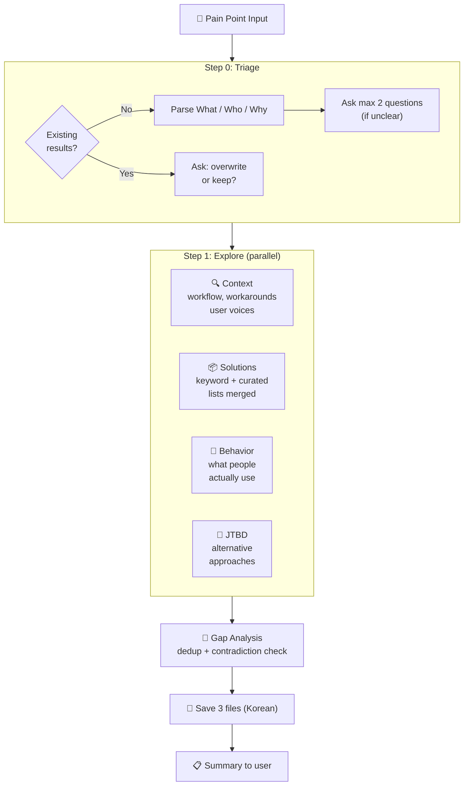

<p align="center">
  <h1 align="center">Groundwork</h1>
  <p align="center">
    Research the problem space before you build.<br>
    A landscape scan skill for <a href="https://docs.anthropic.com/en/docs/claude-code">Claude Code</a>.
  </p>
</p>

<p align="center">
  <a href="LICENSE"></a>
  <a href="https://docs.anthropic.com/en/docs/claude-code"></a>
</p>

<p align="center">
  <a href="README.ko.md">한국어</a>
</p>

---

**Tired of building something that already exists?** Groundwork runs 4 parallel research agents to scan the landscape — who has this problem, how they work around it, and what solutions exist — so you can make informed decisions before writing a single line of code.

## Quick Start

```bash
# Install
mkdir -p ~/.claude/skills/groundwork && curl -sL https://raw.githubusercontent.com/SC-Airu/groundwork-skill/main/SKILL.md -o ~/.claude/skills/groundwork/SKILL.md

# Use in Claude Code
/groundwork auto SFX placement for game ad videos in After Effects
```

## What It Does

Give it a pain point. Get back 3 structured research files in ~2 minutes:

```
.omc/groundwork/{slug}/
├── triage.md      # Problem / Who / Why
├── context.md     # Workflow, affected roles, workarounds, adjacent problems, user voices
└── solutions.md   # Solution list, categories, frequency ranking, gaps, key insight
```

## How It Works



## Example Output

Below is a real example from scanning "auto SFX placement for game ad videos".
> **Note:** Default output is in Korean. Shown here in English for readability. Output language is [configurable](#customization).

<details>
<summary><strong>triage.md</strong> — Problem definition</summary>

```markdown
# Triage
- Problem: Auto SFX placement tool for game ad videos.
          AI analyzes video and auto-inserts pre-assigned sound effects per segment. After Effects.
- Who: Game ad video producers (motion designers, creative producers)
- Why: Title-specific sounds are nearly fixed but require manual timing adjustment every time.
       Eliminating repetitive work.
```

</details>

<details>
<summary><strong>context.md</strong> — Workflow & user voices</summary>

```markdown
# Context: Auto SFX Placement

## Current Workflow
Occurs in game studio UA ad video production pipeline:
1. Creative team receives ad brief (15-30 sec video)
2. Motion designer assembles gameplay footage/animation in After Effects
3. Manually places SFX from title-specific fixed SFX library onto timeline
4. A/B test variations repeat — SFX must be re-placed each time

## Who Is Affected
| Role | Responsibility | Skill Level |
|------|---------------|-------------|
| Motion Designer | Assembles ad video + places SFX directly in AE | AE mid-advanced, non-expert in audio |
| Video Editor | Editing + basic sound design combined | Generalist, high-volume processing |

## Current Workarounds
1. Manual timeline scrubbing — numpad * key for markers → manual SFX placement
2. MonkeySauce — marker→SFX assignment automation (but markers are still manual)
3. Template-based pre-rigging — AE project templates with pre-positioned SFX

## User Voices
> "Sound is often left until the end of the process when sound is actually
>  responsible for half OR MORE of the emotional impact of work."
> — School of Motion
```

</details>

<details open>
<summary><strong>solutions.md</strong> — Solution landscape (key sections)</summary>

```markdown
# Solution Landscape: Auto SFX Placement

## Solution List
| Name | Approach | Strengths | Weaknesses |
|------|----------|-----------|------------|
| MonkeySauce | AE script: marker-based SFX trigger | AE native, custom SFX supported | Markers are manual, no video analysis |
| ElevenLabs V2S | AI: GPT-4o vision → SFX generation | API available | No custom library support |
| MMAudio | Open source: video→audio synthesis | Free, runs locally | Generates ambient, not individual SFX |
| CapCut Auto | Consumer editor: AI SFX auto-placement | Free, fast | Consumer-grade, no custom SFX |
| ... | (24 solutions total) | | |

## Categories
1. AE Native Tools (manual/semi-auto) — MonkeySauce, Boombox, SoundBox ...
2. AI SFX Generation (new sound synthesis) — ElevenLabs, MMAudio, FoleyCrafter ...
3. Consumer Auto SFX Editors — CapCut, Submagic, FlexClip ...
4. Game Engine Direct Capture — Unreal Take Recorder, UE4Capture

## Key Gap
No tool solves the 3-layer problem:
| Layer | Required | Existing Tools |
|-------|----------|---------------|
| 1. Event Detection | AI detects game events | ElevenLabs (partial) |
| 2. SFX Mapping | Event → custom SFX selection | MonkeySauce (manual) |
| 3. AE Placement | Place at exact frame | MonkeySauce, ExtendScript |

## Contradictions
| Contradiction | Marketing | Reality |
|--------------|-----------|---------|
| AI SFX tool viability | "Many exist" | No game ad pros actually use them |
| MonkeySauce sufficiency | "24 recipes for automation" | Only solves assignment, not detection |

## Key Insight
The problem exists not because there are no tools, but because each tool
only solves a different layer. AI vision can detect events, AE scripting
can place SFX. But no integration layer connects them while mapping
to custom SFX libraries.
```

</details>

### Terminal Summary

After research completes, you get a brief summary:

```
## Groundwork Complete: sound-auto-placement

### Context
- Game ad motion designers manually place title-specific SFX on every video
- Main workaround: MonkeySauce (marker→SFX automation, but markers are manual)

### Solution Landscape
- 24 solutions across 7 categories
- Key insight: No tool solves the 3-layer problem (detection/mapping/placement)
- Key gap: Many AI SFX tools exist but none support custom SFX libraries

### Files
- .omc/groundwork/sound-auto-placement/triage.md
- .omc/groundwork/sound-auto-placement/context.md
- .omc/groundwork/sound-auto-placement/solutions.md
```

## Features

- **4 parallel research agents** — Context, Solutions, Behavior, JTBD run simultaneously (~2-3 min)
- **Gap analysis** — Finds what no existing tool covers
- **Contradiction detection** — Catches "marketed as X" vs "users say Y" discrepancies
- **Duplicate check** — Won't overwrite existing research without asking
- **Facts only** — No build/kill recommendations. You decide.
- **English search, localized output** — Searches in English for broad coverage, saves in Korean (configurable)

## Requirements

- [Claude Code](https://docs.anthropic.com/en/docs/claude-code) CLI
- [oh-my-claudecode](https://github.com/nicholasgriffintn/oh-my-claudecode) (for `document-specialist` agent routing)

## Usage

```bash
# Korean input
/groundwork 게임 사운드 자동 배치 - AI가 영상 분석해 효과음 자동 삽입

# English input
/groundwork auto SFX placement for game ad videos in After Effects

# Detailed input (skips triage questions)
/groundwork Music Prompt Builder - a tool that generates Suno AI BGM prompts
  through simple clicks. Planners select game background, style, mood, tempo,
  instruments and get translated professional music terminology prompts.
```

## Customization

<details>
<summary><strong>Change output language</strong></summary>

Edit the `<Execution_Policy>` section in `SKILL.md`:

```
- All saved files: written in Korean.
```

Change to your preferred language. Research agents always search in English.

</details>

<details>
<summary><strong>Adjust search depth</strong></summary>

Each agent has a `Limit to N web searches max` instruction. Defaults: 10 for most agents, 8 for JTBD.

- Increase for deeper research
- Decrease for speed

</details>

<details>
<summary><strong>Use with downstream skills</strong></summary>

Groundwork output is designed to feed into other skills:

| Skill | How |
|-------|-----|
| `/plan` | Reads `triage.md` for problem context |
| `CLAUDE.md` | Reference groundwork files for team context |

</details>

## Design Decisions

| Decision | Why |
|----------|-----|
| **4 agents, not 6** | Keyword + Curated merged (70% overlap in testing). Behavior kept separate — finds what people *use* vs what's *marketed*. |
| **No Gap Check agent** | Orchestrator handles dedup + contradiction inline. No quality loss in testing. |
| **English search** | Broader coverage than localized search. Output language is separate. |
| **No depth modes** | Single mode. 4 agents is the sweet spot between speed and coverage. |

## Research Agents

Each agent has a distinct search strategy and source set:

| Agent | Role | Sources | Strategy | Limit |
|-------|------|---------|----------|-------|
| **Context** | Workflow, workarounds, user voices | Reddit, HN, forums, Stack Overflow | Community-focused: finds direct quotes and real frustrations | 10 searches |
| **Solutions** | Existing tools and products | GitHub, Product Hunt, G2, Capterra, AlternativeTo, "awesome-*" lists, "best X alternatives" articles | Keyword + curated lists merged (70% overlap in testing when separate) | 10 searches |
| **Behavior** | What people *actually* use | Reddit, forums, Stack Overflow, HN | Searches "how do you handle..." and "what do you use for..." discussions — separates marketed claims from real usage | 10 searches |
| **JTBD** | Alternative approaches | Cross-industry, cross-domain | Jobs-to-be-Done lens: finds non-obvious competitors solving the same job differently | 8 searches |

All agents search in **English** regardless of input language, for maximum coverage. After all 4 complete, the orchestrator runs gap analysis inline: deduplicates solutions, cross-references workarounds, identifies structural gaps, and flags contradictions.

## Contributing

Issues and PRs welcome. This is a single-file skill (`SKILL.md`) — keep changes focused.

## License

[MIT](LICENSE)
